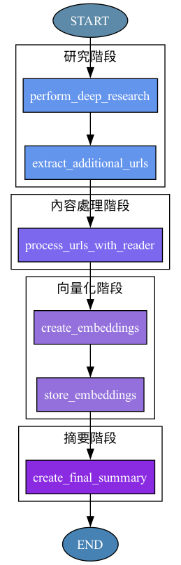
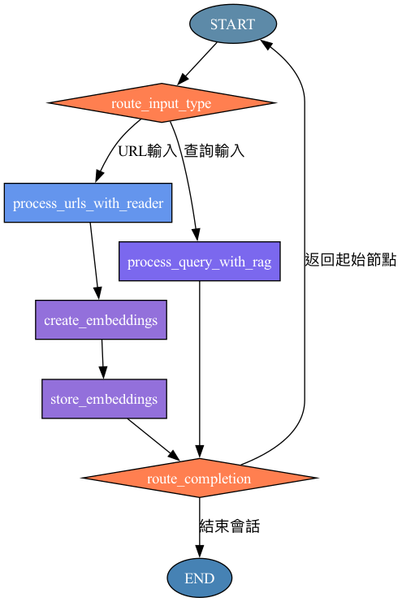
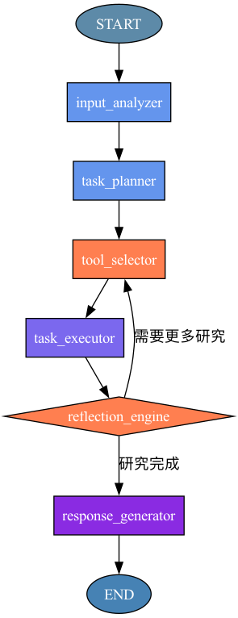

# Jina LangGraph 研究助手

這個專案實現了三種不同的智能研究助手方案，使用 LangGraph 框架和 Jina AI 服務構建。每種方案都提供了不同的功能和流程，用於自動化研究、處理內容和生成見解。

## 專案概述

本專案基於 LangGraph 和 Jina AI 服務，實現了三種不同的研究助手方案：

1. **方案一：自動研究流程** - 線性研究流程，從研究主題開始，自動進行深度研究、內容處理和向量化存儲
2. **方案二：靈活輸入與 RAG 集成** - 支持 URL 處理和查詢處理兩種路徑的流程
3. **方案三：Agentic RAG 智能助手** - 基於代理的智能研究助手，可以規劃任務、選擇工具、執行任務並進行反思

## 專案結構

```
jina-langgraph-research-assistant/
├── flow_implementations/          # 三種方案的實現
│   ├── method_one/                # 方案一：自動研究流程
│   ├── method_two/                # 方案二：靈活輸入與 RAG 集成
│   ├── method_three/              # 方案三：Agentic RAG 智能助手
│   ├── diagrams/                  # 流程圖
│   └── visualize_graphs.py        # 生成流程圖的腳本
└── Jina_guideline/                # Jina AI 服務使用指南和參考資料
```

## 方案詳解

### 方案一：自動研究流程

這是一個線性的研究流程，從研究主題開始，自動進行深度研究、內容處理和向量化存儲。

**流程節點：**
1. `perform_deep_research` - 使用 Jina DeepSearch 進行深度研究
2. `extract_additional_urls` - 從研究報告中提取額外 URL
3. `process_urls_with_reader` - 處理 URL 內容
4. `create_embeddings` - 創建向量嵌入
5. `store_embeddings` - 存儲向量數據
6. `create_final_summary` - 生成最終摘要



### 方案二：靈活輸入與 RAG 集成

這是一個可處理不同輸入類型的流程，支持 URL 處理和查詢處理兩種路徑。

**流程節點：**
1. `route_input_type` - 根據輸入類型路由
2. `process_urls_with_reader` - 處理 URL 內容（URL 路徑）
3. `create_embeddings` - 創建向量嵌入（URL 路徑）
4. `store_embeddings` - 存儲向量數據（URL 路徑）
5. `process_query_with_rag` - 使用 RAG 處理查詢（查詢路徑）
6. `route_completion` - 決定是結束會話還是返回起始節點



### 方案三：Agentic RAG 智能助手

這是一個基於代理的智能研究助手，可以規劃任務、選擇工具、執行任務並進行反思。

**流程節點：**
1. `input_analyzer` - 分析用戶輸入的意圖
2. `task_planner` - 根據意圖規劃任務
3. `tool_selector` - 為任務選擇合適的工具
4. `task_executor` - 執行選定的任務
5. `reflection_engine` - 反思執行結果並決定下一步
6. `response_generator` - 生成最終響應



## 安裝與依賴

要運行這個專案，您需要安裝以下依賴：

```bash
pip install langgraph httpx pydantic qdrant-client graphviz
```

## 使用方法

### 方案一：自動研究流程

```python
from flow_implementations.method_one import graph as method_one_graph

# 執行自動研究流程
result = method_one_graph.invoke({"research_topic": "人工智能在醫療領域的應用"})

# 獲取最終摘要
final_summary = result.final_summary
print(final_summary)
```

### 方案二：靈活輸入與 RAG 集成

```python
from flow_implementations.method_two import graph as method_two_graph

# URL 輸入
url_result = method_two_graph.invoke({
    "input_type": "url",
    "url_input": "https://example.com/ai-in-healthcare"
})

# 查詢輸入
query_result = method_two_graph.invoke({
    "input_type": "query",
    "query_input": "人工智能如何改善醫療診斷？"
})

print(url_result.url_content)  # URL 處理結果
print(query_result.rag_results)  # 查詢處理結果
```

### 方案三：Agentic RAG 智能助手

```python
from flow_implementations.method_three import graph as method_three_graph

# 執行智能助手
result = method_three_graph.invoke({
    "user_input": "研究人工智能在醫療診斷中的最新進展"
})

# 獲取最終響應
final_response = result.final_response
print(final_response)
```

## 生成流程圖

您可以使用 `visualize_graphs.py` 腳本生成所有三個流程的可視化圖形：

```bash
cd jina-langgraph-research-assistant
python flow_implementations/visualize_graphs.py
```

## Jina AI 服務

本專案使用以下 Jina AI 服務：

- **Jina DeepSearch** - 進行深度網絡研究，生成綜合報告
- **Jina Reader** - 提取和處理網頁內容
- **Jina Embeddings** - 將內容轉換為向量表示

要使用這些服務，您需要獲取 Jina API 密鑰並在配置中設置它。

## 貢獻與開發

歡迎對本專案進行貢獻！您可以通過以下方式參與：

1. Fork 本專案
2. 創建您的功能分支 (`git checkout -b feature/amazing-feature`)
3. 提交您的更改 (`git commit -m 'Add some amazing feature'`)
4. 推送到分支 (`git push origin feature/amazing-feature`)
5. 開啟一個 Pull Request

## 許可證

本專案採用 MIT 許可證 - 詳情請參閱 [LICENSE](LICENSE) 文件。

## 致謝

- 本專案受到 [AllNew_DeepResearch/local-deep-researcher](https://github.com/yourusername/AllNew_DeepResearch) 專案的啟發
- 感謝 Jina AI 提供的強大 AI 服務
- 感謝 LangGraph 團隊開發的優秀框架

## 作者

Kevin Luo - 2025年4月12日
# Langgraph_JinaAI_DR_AgenticRAG_Graphflow
